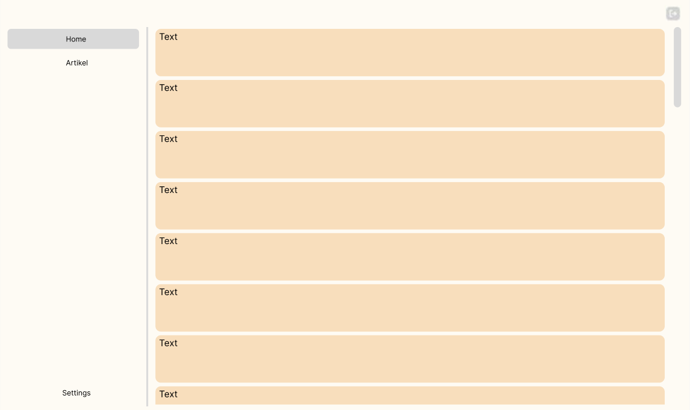
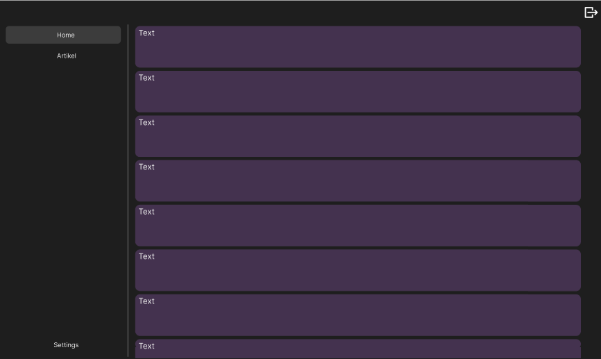
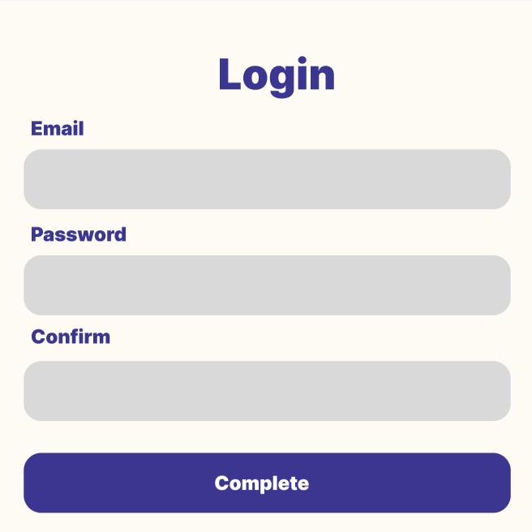
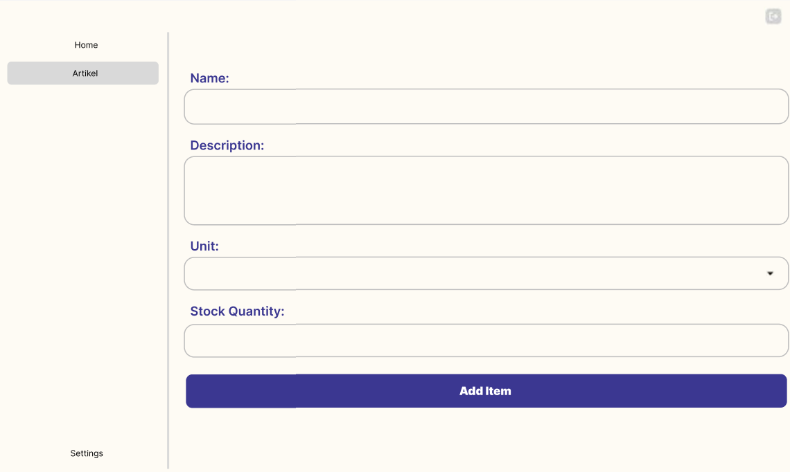
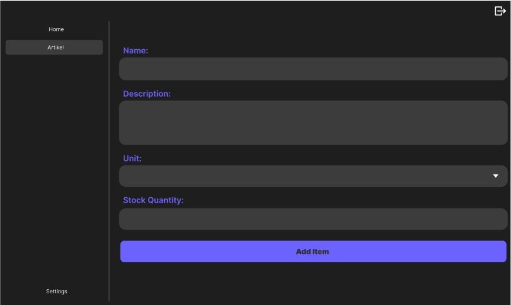
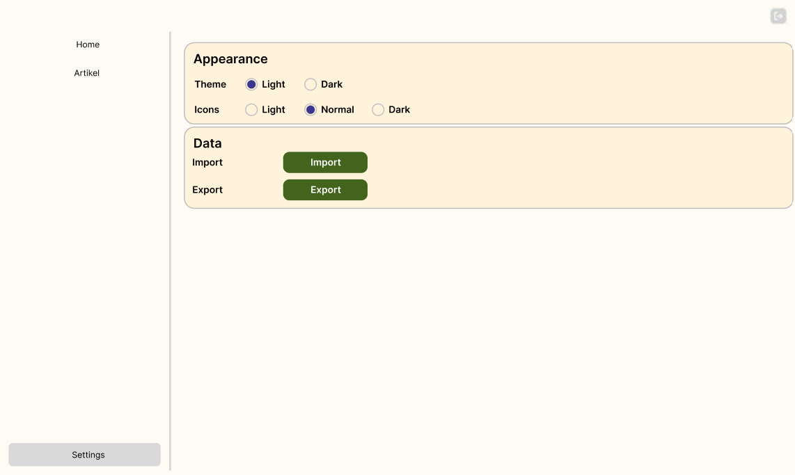
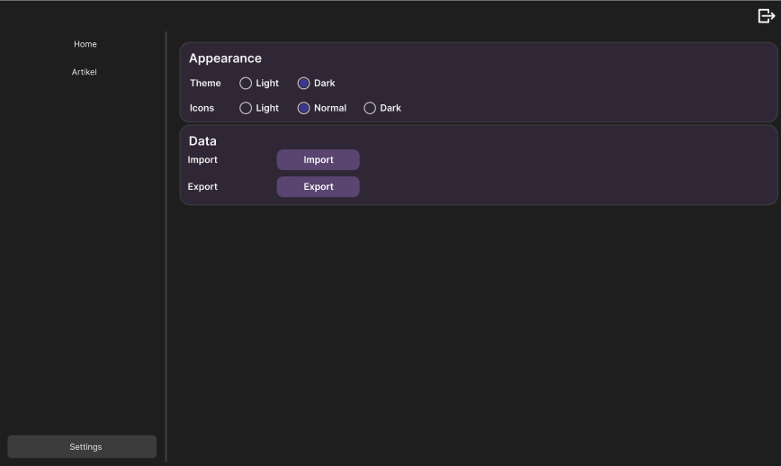

<h1 align="center">✨Mockups Overview✨</h1>

  A visual overview of all views in both 
  <mark style="background-color: #ffffff;"><strong>Light Mode</strong></mark> 
  and 
  <mark style="background-color: #000000; color: white;"><strong>Dark Mode</strong></mark>. 

---

## 🏠 Home View

   
  

---

## 🔐 Login View

   
  

---

## 📄 Artikel View

   
  

---

## ⚙️ Settings View

   
  

---

